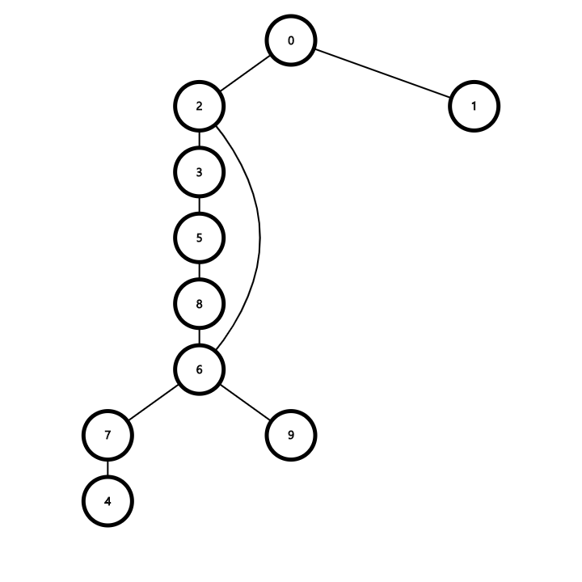

# BFS

<hr>

## 정의

&nbsp;`BFS`는 너비 우선 탐색(`Breadth First Search`)의 약자이다. `DFS`와 그래프 탐색 방식의 축을 이룬다.
다익스트라 알고리즘(`Dijkstra's algorithm`)과 프림 알고리즘(`Prim's algorithm`)에 사용되며 주로 최단 경로를 구하는데 사용된다.

<hr>

## 시간 복잡도(`Time Complexity`)

- 인접 리스트(`Adjacency List`) : `O(|V| + |E|)`
  
- 인접 행렬(`Adjacency Array`) : `O(|V|^2)`

<hr>

## Code

```C++
#include <algorithm>
#include <iostream>
#include <queue>
#include <vector>

using namespace std;

vector<vector<int>> adj;

void bfs(int start, vector<int>& dist, vector<int>& parent)
{
    dist = vector<int>(adj.size(), -1);
    parent = vector<int>(adj.size(), -1);

    // start부터 시작
    queue<int> q;
    dist[start] = 0;
    // 처음 parent 값을 자기자신으로 한다.
    // parent는 경로 탐색을 위해 필요
    parent[start] = start;
    q.push(start);
    // distance를 이용하는 priority_queue를 사용하지 않아도 문제가 없다.
    // queue에 들어가는 순서대로 진행하여도 최단 경로를 찾을 수 있기 때문
    while (!q.empty()) {
        int cur = q.front();
        q.pop();

        // here의 모든 인접한 정점을 검사한다.
        for (int i = 0; i < adj[cur].size(); ++i) {
            int next = adj[cur][i];
            // 처음 보는 정점이면 방문 목록에 집어넣는다.
            // 처음 보는 정점일 때 무조건 최단거리가 된다.
            if (dist[next] == -1) {
                q.push(next);
                // next의 거리를 cur의 거리 + 1로 지정한다.
                dist[next] = dist[cur] + 1;
                // next 정점의 부모(이전에 위치)를 cur로 변경한다.
                parent[next] = cur;
            }
        }
    }
}

// 시작점 -> V까지의 최단 경로 값을 반환하는 함수
vector<int> shortestPath(int V, const vector<int>& parent)
{
    vector<int> path(1, V);
    // V의 부모가 V가 아닌 다른 노드라면
    while (parent[V] != V) {
        // V를 V의 부모 값으로 바꿔준 후
        V = parent[V];
        // 경로에 V를 넣어준다.
        path.push_back(V);
    }
    // 도착점에서 시작점으로 진행하면서 path에 값을 넣었기 때문에
    // 원소들을 reverse 해줘야한다.
    reverse(path.begin(), path.end());
    return path;
}

int main()
{
    int V, N, st, ed;
    cout << "Input\n";
    cout << "-------------------------\n";
    cin >> V >> N >> st >> ed;
    adj.resize(V);

    for (int i = 0; i < N; ++i) {
        int v1, v2;
        cin >> v1 >> v2;

        adj[v1].push_back(v2);
        adj[v2].push_back(v1);
    }

    vector<int> dist;
    vector<int> parent;

    bfs(st, dist, parent);
    cout << "\nOutput\n";
    cout << "-------------------------\n";
    cout << "Num of Vertex & Edge : " << V << ", " << N << '\n';
    cout << "Start : " << st << ", End : " << ed << '\n';
    cout << "-------------------------\n";
    for (int i = 0; i < adj.size(); ++i) {
        sort(adj[i].begin(), adj[i].end());
        for (int j = 0; j < adj[i].size(); ++j) {
            if (adj[i][j] < i) continue;
            cout << "(" << i << ", " << adj[i][j] << ")" << '\n';
        }
    }
    cout << "-------------------------\n";
    cout << "Distance from vertex " << st << '\n';
    for (int i = 0; i < dist.size(); ++i) {
        cout << dist[i] << ' ';
    }
    cout << '\n';
    cout << "-------------------------\n";
    vector<int> path = shortestPath(ed, parent);
    cout << "Path from vertex " << st << " to vertex " << ed << '\n';
    for (int i = 0; i < path.size(); ++i) {
        cout << path[i] << ' ';
    }
    cout << '\n';
    cout << "-------------------------\n";

    return 0;
}
```

<hr>

## Example

### Input
&nbsp;&nbsp;&nbsp;&nbsp;&nbsp;

### Graph
&nbsp;&nbsp;&nbsp;&nbsp;&nbsp;

### Output
&nbsp;&nbsp;&nbsp;&nbsp;&nbsp;