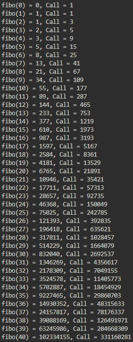
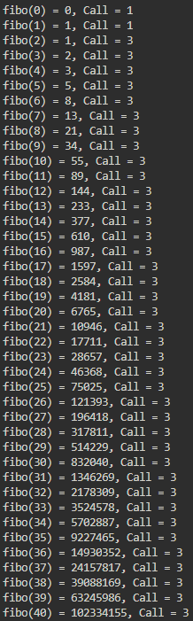

## DP

&nbsp;`DP`는 `Dynamic Programmging`의 약자로 똑같은 답을 구하기 위해 여러 번 계산하는 것을 방지하고 이전에 구한 답을 재활용할 수 있게 만들어주는 알고리즘 기법이다.

<hr>

## 재귀 함수를 이용한 fibonacci 구하기

```C++
#include <iostream>

using namespace std;

int call = 0;

long long fibo(long long num)
{
    ++call;
    if (num == 0) return 0;
    if (num == 1) return 1;

    return fibo(num - 1) + fibo(num - 2);
}

int main()
{
    for (int i = 0; i < 50; ++i) {
        call = 0;
        cout << "fibo(" << i << ") = " << fibo(i) << ", Call = " << call << '\n';
    }
    return 0;
}
```

### Output



<hr>

## DP을 이용한 fibonacci 구하기

```C++
// call을 구하기 위하여 함수로 작성했으나 실제로는
// dp[i] = dp[i - 1] + dp[i - 2] 점화식을 이용하면 굳이 함수를 작성하지 않아도
// 쉽게 dp를 계산할 수 있다.
#include <iostream>
#include <vector>

using namespace std;

int call = 0;
vector<long long> dp;

long long fibo(long long num)
{
    ++call;
    if (dp.size() > num) return dp[num];
    if (num == 0) {
        dp.push_back(num);
        return dp[num];
    }
    if (num == 1) {
        dp.push_back(num);
        return dp[num];
    }

    dp.push_back(fibo(num - 1) + fibo(num - 2));
    return dp.back();
}

int main()
{
    for (int i = 0; i < 50; ++i) {
        call = 0;
        cout << "fibo(" << i << ") = " << fibo(i) << ", Call = " << call << '\n';
    }
    return 0;
}
```

### Output



<hr>

## 결과

&nbsp;재귀함수를 이용한 결괏값을 보면 `fibo`에서 값이 1 증가할 때마다 함수 호출 횟수가 약 1.6배씩 증가하는 것을 알 수 있다. 이처럼 재귀함수는 이전에 구했는지 아닌지와 관계없이 똑같은 값을 구하기 위해 함수를 중복호출 한다.

&nbsp;반면 `DP`를 이용한 `fibo` 함수는 `fibo(n)`의 값을 `dp[n]`에 저장해놓고 재사용하기 때문에 똑같은 연산을 반복해서 할 필요가 없다. 그러므로 `fibo(0)`과 `fibo(1)`을 제외한 나머지 `fibo(n)`의 호출 횟수는 항상 3번(`fibo(n)`, `fibo(n - 1)`, `fibo(n - 2)`을 한 번씩 호출)이다. 이렇게 구한 값을 저장하여 재활용하는 기법을 메모이제이션(`Memoization`)이라고 한다. 메모이제이션은 주로 DP 구현과 함께 쓰인다.