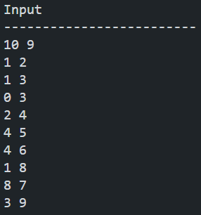
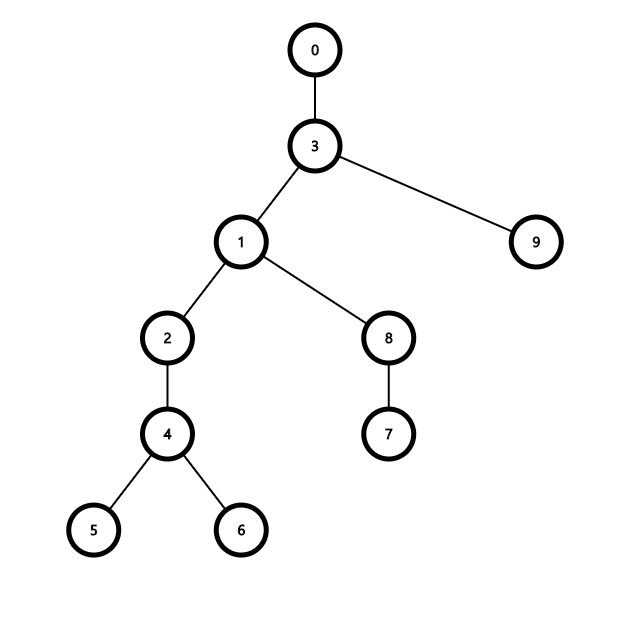
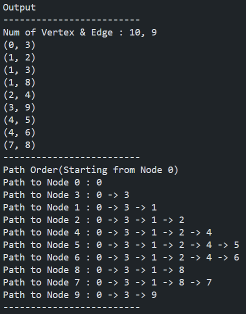

## DFS

&nbsp;`DFS`는 깊이 우선 탐색(`Depth First Search`)의 약자이다. `BFS`와 그래프 탐색 방식의 축을 이룬다. `DFS`는 현재 정점의 인접한 정점들 중 방문하지 않은 곳이 있다면 바로 그 정점으로 이동하는 방식으로 진행된다. 만약 현재 정점의 인접한 정점들이 이전에 모두 방문한 곳이거나 인접한 정점이 하나도 없을 때 현재 정점을 빠져나간다.

&nbsp;`DFS`는 `BFS`에 비해 다양한 용도로 사용된다.

<hr>

## 시간 복잡도(Time Complexity)

- 인접 리스트(Adjacency List) : `O(|V| + |E|)`
  
- 인접 행렬(Adjacency Array) : `O(|V|^2)`

<hr>

## Code

```C++
#include <algorithm>
#include <iostream>
#include <string>
#include <vector>

using namespace std;

// 각 정점을 방문했는지 여부를 확인
vector<bool> visited;
vector<vector<int>> adj;

void dfs(int here, string path)
{
    // cout << "DFS visits " << here << '\n';
    visited[here] = true;
    // 모든 인접 정점을 순회하기 위한 for문
    for (int i = 0; i < adj[here].size(); ++i) {
        int there = adj[here][i];
        // 아직 방문한 적 없다면 방문한다.
        if (!visited[there]) {
            cout << "Path to Node " << there << " : ";
            cout << path + " -> " + to_string(there) << '\n';
            dfs(there, path + " -> " + to_string(there));
        }
    }
}

void dfsAll()
{
    visited = vector<bool>(adj.size(), false);
    // 모든 정점을 순회하면서, 아직 방문한 적 없으면 방문한다.
    for (int i = 0; i < adj.size(); ++i) {
        if (!visited[i]) {
            cout << "Path to Node " << i << " : " << i << '\n';
            dfs(i, to_string(i));
        }
    }
}

int main()
{
    int V, N;
    cout << "Input\n";
    cout << "-------------------------\n";
    cin >> V >> N;
    adj.resize(V);

    for (int i = 0; i < N; ++i) {
        int v1, v2;
        cin >> v1 >> v2;

        adj[v1].push_back(v2);
        adj[v2].push_back(v1);
    }

    cout << "\nOutput\n";
    cout << "-------------------------\n";
    cout << "Num of Vertex & Edge : " << V << ", " << N << '\n';
    for (int i = 0; i < adj.size(); ++i) {
        sort(adj[i].begin(), adj[i].end());
        for (int j = 0; j < adj[i].size(); ++j) {
            if (adj[i][j] < i) continue;
            cout << "(" << i << ", " << adj[i][j] << ")" << '\n';
        }
    }
    cout << "-------------------------\n";
    cout << "Path Order(Starting from Node 0)\n";
    dfsAll();
    cout << "-------------------------\n";

    return 0;
}
```

<hr>

## Example

### Input
&nbsp;&nbsp;&nbsp;&nbsp;&nbsp;

### Graph
&nbsp;&nbsp;&nbsp;&nbsp;&nbsp;

### Output
&nbsp;&nbsp;&nbsp;&nbsp;&nbsp;

<hr>