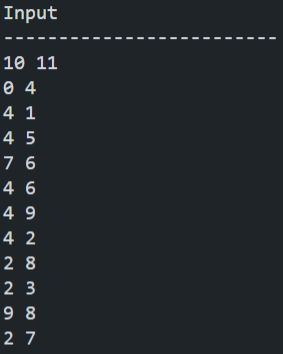
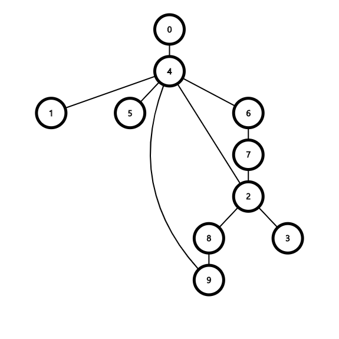
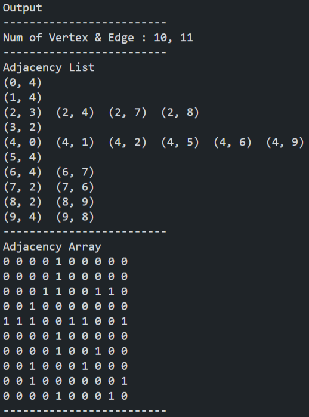

## 그래프(Graph)

&nbsp;그래프(`Graph`)는 정점 `Vertex`와 간선 `Edge`로 이루어진 자료 구조이다. 선형으로 풀 수 없는 많은 문제들을 해결할 수 있게 해준다.

<hr>

## 그래프의 표현 방식

### 1. 인접 행렬(Adjacency Array)

&nbsp;인접 행렬은 `Vertex * Vertex` 크기의 행렬을 만들어 그래프를 표현하는 방식이다.

`Array[i][j]` : `i`에서 `j`로 가는 `Edge`가 있는지의 여부 혹은 `i`에서 `j`까지의 거리를 나타냄

&nbsp;원하는 위치를 쉽게 참조할 수 있다는 장점이 있다. 하지만 어떤 상황에서도 행렬의 크기는 `Vertex * Vertex`이기 때문에 간선의 개수가 적으면 비효율적이다.

### 2. 인접 리스트(Adjacency List)

&nbsp;인접 리스트는 각 정점별로 이어져있는 정점만을 저장하는 방식의 그래프 표현 방식이다.

`List[i][j]` : `i` 정점과 연결되어있는 다른 정점 중 하나(어떤 값이 들어가있는지 탐색 전에는 모른다)

&nbsp;간선의 개수가 `Vertex^2` 보다 작을 때 공간의 효율성에 있어서 인접 행렬보다 좋다. 보통의 그래프는 `Vertex^2` 이하의 간선을 가지고 있기 때문에 인접 리스트로 구현하는 것이 인접 행렬보다 유리하다고 볼 수 있다.

<hr>

## 시간 복잡도(Time Complexity)

- 인접 리스트(Adjacency List) : `O(|V| + |E|)`

- 인접 행렬(Adjacency Array) : `O(|V|^2)`
  
<hr>

## 공간 복잡도(Space Complexity)

- 인접 리스트(Adjacency List) : `O(|V| + |E|)`

- 인접 행렬(Adjacency Array) : `O(|V|^2)`

<hr>

## Code

```C++
#include <algorithm>
#include <iostream>
#include <vector>

using namespace std;

int V, E;
// 인접 리스트
vector<vector<int>> adjList;
// 인접 행렬
vector<vector<bool>> adjArr;

int main()
{
    cout << "Input\n";
    cout << "-------------------------\n";
    cin >> V >> E;

    adjList.resize(V);
    adjArr.resize(V, vector<bool>(V, false));

    for (int i = 0; i < E; ++i) {
        int v1, v2;
        cin >> v1 >> v2;

        // 인접 리스트 : 각각의 정점에 push_back을 이용해 원소를 추가한다.
        adjList[v1].push_back(v2);
        adjList[v2].push_back(v1);
        // 인접 행렬 : (v1, v2), (v2, v1)에 직접 접근에 true로 값을 변경한다.
        adjArr[v1][v2] = true;
        adjArr[v2][v1] = true;
    }

    cout << "\nOutput\n";
    cout << "-------------------------\n";
    cout << "Num of Vertex & Edge : " << V << ", " << E << '\n';
    cout << "-------------------------\n";
    cout << "Adjacency List\n";
    for (int i = 0; i < adjList.size(); ++i) {
        sort(adjList[i].begin(), adjList[i].end());
        for (int j = 0; j < adjList[i].size(); ++j) {
            // if (adjList[i][j] < i) continue;
            cout << "(" << i << ", " << adjList[i][j] << ")"
                 << "  ";
        }
        cout << '\n';
    }
    cout << "-------------------------\n";
    cout << "Adjacency Array\n";
    for (int i = 0; i < V; ++i) {
        for (int j = 0; j < V; ++j) {
            cout << adjArr[i][j] << ' ';
        }
        cout << '\n';
    }
    cout << "-------------------------\n";

    return 0;
}
```

<hr>

## Example

### Input
&nbsp;&nbsp;&nbsp;&nbsp;&nbsp;

### Graph
&nbsp;&nbsp;&nbsp;&nbsp;&nbsp;

### Output
&nbsp;&nbsp;&nbsp;&nbsp;&nbsp;

<hr>